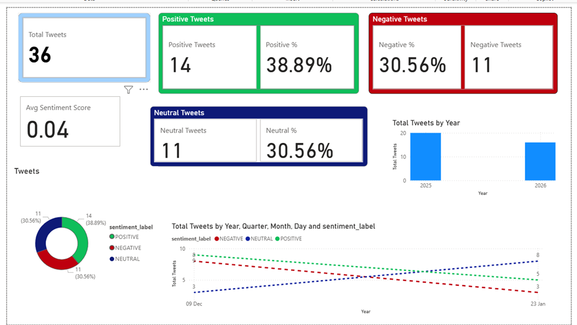

# Twitter Sentiment Analysis Pipeline

A production-ready, cloud-native sentiment analysis system that collects tweets in real-time from Twitter/X API, performs NLP-based sentiment analysis, and stores results in Google BigQuery using a medallion architecture.

## Overview

This project implements an end-to-end data pipeline for monitoring and analyzing sentiment trends across social media. It processes tweets through multiple layers of transformation (Bronze → Silver → Gold), applying advanced NLP techniques to extract actionable insights from unstructured text data.

## Features

- **Real-time Data Collection**: Polls Twitter API v2 for tweets matching predefined search queries
- **Dual Sentiment Analysis**: Combines TextBlob and VADER sentiment analyzers for robust scoring
- **Text Preprocessing**: Automatic cleaning (URL removal, stopword filtering, tokenization)
- **Medallion Architecture**: Bronze (raw) → Silver (enriched) → Gold (aggregated) data layers
- **Cloud-Native Processing**: Serverless execution using Google Cloud Functions
- **Optimized Storage**: BigQuery tables with partitioning and clustering for high-performance queries
- **Incremental Processing**: Watermark-based tracking to process only new data
- **Comprehensive Metrics**: Includes polarity scores, confidence levels, and sentiment labels (POSITIVE/NEGATIVE/NEUTRAL)

## Architecture

```
Twitter API (v2)
       ↓
TwitterCollector (Tweepy)
       ↓
Google Pub/Sub Topic
       ↓
Cloud Function (pubsub-to-bigquery)
       ↓
BigQuery Bronze Layer (raw_tweets)
       ↓
Sentiment Analysis Pipeline
       ↓
BigQuery Silver Layer (tweet_sentiment)
       ↓
Daily Aggregation
       ↓
BigQuery Gold Layer (daily_sentiment_fact)
```

## Prerequisites

- **Python 3.8+**
- **Google Cloud Account** with the following enabled:
  - BigQuery API
  - Pub/Sub API
  - Cloud Functions API
  - Cloud Storage API
- **Twitter API v2 Credentials** (API key, API secret, Bearer token)
- **GCP Service Account** with appropriate IAM permissions

## Installation

1. **Clone the repository**
   ```bash
   git clone <repository-url>
   cd TwitterX_Analysis
   ```

2. **Install dependencies**
   ```bash
   pip install -r requirements.txt
   ```

3. **Set up GCP credentials**
   - Download your GCP service account JSON key
   - Place it at `config/GcpKey.json`
   - Set the environment variable:
     ```bash
     export GOOGLE_APPLICATION_CREDENTIALS="config/GcpKey.json"
     ```

4. **Configure Twitter API credentials**
   - Edit `config/twitter_config.py`
   - Add your Twitter API v2 credentials:
     - `API_KEY`
     - `API_SECRET`
     - `BEARER_TOKEN`

5. **Configure GCP settings**
   - Edit `config/gcp_details_config.py`
   - Update:
     - `GCP_PROJECT_ID`
     - `GCP_REGION`
     - Pub/Sub topic names
     - BigQuery dataset and table names
     - Cloud Storage bucket names

## Configuration

### Twitter API Configuration (`config/twitter_config.py`)

```python
API_KEY = "your_api_key"
API_SECRET = "your_api_secret"
BEARER_TOKEN = "your_bearer_token"

# Search queries to monitor
SEARCH_QUERIES = [
    "#politics",
    "#news",
    "#breaking",
    # Add more queries as needed...
]
```

### GCP Configuration (`config/gcp_details_config.py`)

```python
GCP_PROJECT_ID = "your-project-id"
GCP_REGION = "us-central1"
PUBSUB_TOPIC = "twitter-raw-tweets"
BRONZE_DATASET = "twitter_bronze"
SILVER_DATASET = "twitter_silver"
GOLD_DATASET = "twitter_gold"
```

## Usage

### 1. Verify Infrastructure

Check if all required GCP resources exist:

```bash
python scripts/verify_infrastructure.py
```

### 2. Create Missing Resources

Automatically provision missing BigQuery datasets and Pub/Sub topics:

```bash
python scripts/create_missing_resources.py
```

### 3. Collect Tweets

Start collecting tweets from Twitter API and publish to Pub/Sub:

```bash
python src/ingestion/twitter_collector.py
```

### 4. Run Sentiment Analysis (Silver Pipeline)

Process raw tweets and add sentiment scores:

```bash
python scripts/run_silver_pipeline.py
```

### 5. Run Aggregation (Gold Pipeline)

Generate daily sentiment summaries:

```bash
python src/processing/gold_pipeline.py
```

### 6. Test Sentiment Analyzer

Verify sentiment analysis functionality:

```bash
python scripts/test_sentiment.py
```

### 7. Query Results

Check processed data in BigQuery:

```bash
python scripts/check_bigquery_simple.py
```

## Project Structure

```
TwitterX_Analysis/
├── src/
│   ├── ingestion/
│   │   └── twitter_collector.py        # Collects tweets & publishes to Pub/Sub
│   └── processing/
│       ├── sentiment_analyzer.py       # NLP sentiment analysis
│       ├── silver_pipeline.py          # Bronze → Silver transformation
│       └── gold_pipeline.py            # Silver → Gold aggregation
│
├── config/
│   ├── twitter_config.py               # Twitter API credentials & queries
│   ├── gcp_details_config.py           # GCP configuration
│   ├── GcpKey.json                     # Service account key (ignored in git)
│   ├── test_storage.py                 # Storage connection tests
│   └── testGcp.py                      # GCP connection tests
│
├── cloud_functions/
│   └── pubsub-to-bigquery/             # Serverless data ingestion
│       ├── main.py                     # Cloud function entry point
│       └── requirements.txt            # Dependencies
│
├── scripts/
│   ├── run_silver_pipeline.py          # Execute sentiment analysis
│   ├── test_sentiment.py               # Unit tests
│   ├── test_complete_pipeline.py       # Integration tests
│   ├── check_bigquery_simple.py        # Data validation
│   ├── verify_infrastructure.py        # Resource validation
│   └── create_missing_resources.py     # Resource provisioning
│
├── sql/
│   ├── silver_tweets.sql               # Sentiment distribution analysis
│   └── analyze_data.sql                # Data preview queries
│
├── requirements.txt                    # Project dependencies
├── .gitignore                          # Git ignore rules
└── README.md                           # This file
```

## Data Pipeline Details

### Bronze Layer (Raw Data)
- **Table**: `twitter_bronze.raw_tweets`
- **Contains**: Raw tweets as collected from Twitter API
- **Schema**: tweet_id, text, author_id, created_at, query, metrics (retweets, likes, replies), ingested_at
- **Partitioning**: By ingestion date

### Silver Layer (Enriched Data)
- **Table**: `twitter_silver.tweet_sentiment`
- **Contains**: Tweets with sentiment scores and cleaned text
- **Additional Columns**:
  - `cleaned_text`: Preprocessed tweet text
  - `textblob_polarity`: Sentiment polarity (-1 to 1)
  - `textblob_subjectivity`: Subjectivity score (0 to 1)
  - `vader_compound`: VADER compound sentiment score (-1 to 1)
  - `vader_positive`, `vader_negative`, `vader_neutral`: Component scores
  - `sentiment_label`: POSITIVE, NEGATIVE, or NEUTRAL
  - `confidence_score`: Confidence of sentiment classification
- **Partitioning & Clustering**: By date and sentiment_label for query optimization

### Gold Layer (Aggregated Data)
- **Table**: `twitter_gold.daily_sentiment_fact`
- **Contains**: Daily sentiment statistics
- **Columns**: date, sentiment_label, tweet_count, avg_sentiment_score, avg_confidence
- **Use Case**: Analytics dashboards and trend analysis

## Monitoring Queries

### Sentiment Distribution
```sql
SELECT sentiment_label, COUNT(*) as count, ROUND(AVG(confidence_score), 3) as avg_confidence
FROM twitter_silver.tweet_sentiment
GROUP BY sentiment_label
```

### Daily Trends
```sql
SELECT date, sentiment_label, tweet_count, avg_sentiment_score
FROM twitter_gold.daily_sentiment_fact
ORDER BY date DESC, sentiment_label
```

### Top Queries by Sentiment
```sql
SELECT query, sentiment_label, COUNT(*) as count
FROM twitter_silver.tweet_sentiment
GROUP BY query, sentiment_label
ORDER BY count DESC
```

## Dependencies

| Package | Version | Purpose |
|---------|---------|---------|
| tweepy | 4.14.0 | Twitter API client |
| google-cloud-bigquery | 3.5.0 | BigQuery data warehouse |
| google-cloud-pubsub | 2.13.0 | Message queue |
| google-cloud-storage | 2.7.0 | Cloud storage |
| textblob | 0.17.1 | Sentiment analysis |
| vader-sentiment | 3.3.2 | VADER sentiment analyzer |
| pandas | 1.5.0 | Data manipulation |
| nltk | 3.8+ | NLP toolkit |

## Sentiment Analysis Details

The pipeline uses two complementary sentiment analyzers:

### TextBlob
- **Polarity**: Ranges from -1 (negative) to 1 (positive)
- **Subjectivity**: Ranges from 0 (objective) to 1 (subjective)
- **Use**: Overall sentiment direction and objectivity assessment

### VADER (Valence Aware Dictionary and Sentiment Reasoner)
- **Compound Score**: -1 (negative) to 1 (positive)
- **Individual Scores**: Positive, negative, and neutral components
- **Use**: Social media-specific sentiment analysis (handles emojis, slang, etc.)

### Classification Rules
- **POSITIVE**: TextBlob polarity > 0.1 AND VADER compound > 0
- **NEGATIVE**: TextBlob polarity < -0.1 AND VADER compound < 0
- **NEUTRAL**: Otherwise

## Deployment

### Deploy Cloud Function

1. Navigate to cloud function directory:
   ```bash
   cd cloud_functions/pubsub-to-bigquery
   ```

2. Deploy using Google Cloud CLI:
   ```bash
   gcloud functions deploy pubsub-to-bigquery \
     --runtime python39 \
     --trigger-topic twitter-raw-tweets \
     --entry-point process_message
   ```

## BI Dashboard

### Overview

The project includes integration with **Microsoft Power BI** for real-time visualization and monitoring of sentiment analysis results. The dashboard provides comprehensive insights into social media sentiment trends across multiple dimensions with interactive charts, KPIs, and detailed analytics.

### Dashboard Setup

#### Prerequisites
- Microsoft Power BI Desktop (latest version)
- Power BI Service subscription (for sharing and collaboration)
- BigQuery data sources already populated with data
- Service account credentials with BigQuery access

#### Connecting to BigQuery

1. **Open Power BI Desktop**
   - Launch Power BI Desktop application

2. **Connect to BigQuery Data Source**
   - Click "Get Data" → "More"
   - Search for "Google BigQuery"
   - Select "Google BigQuery" and click "Connect"
   - Sign in with your Google Cloud credentials
   - Select your GCP project
   - Choose `twitter_gold.daily_sentiment_fact` table
   - Click "Load"

3. **Load Additional Tables** (Optional)
   - Repeat steps 2-3 for `twitter_silver.tweet_sentiment` for detailed analysis
   - This enables drill-down capabilities

4. **Create Data Model**
   - Establish relationships between tables if using multiple sources
   - Configure data types and formatting

### Dashboard Components

The recommended dashboard includes the following visualizations:

#### 1. **Overall Sentiment Summary** (Scorecard)
- Metrics: Total tweets analyzed, Positive/Negative/Neutral counts
- Filters: Date range selector
- Purpose: High-level overview of sentiment distribution

#### 2. **Daily Sentiment Trend** (Time Series Chart)
- X-axis: Date
- Y-axis: Tweet count
- Series: Grouped by sentiment_label (3 lines for Positive, Negative, Neutral)
- Purpose: Monitor sentiment evolution over time

#### 3. **Sentiment Distribution Pie Chart**
- Segments: sentiment_label
- Size: tweet_count
- Colors: Green (Positive), Red (Negative), Gray (Neutral)
- Purpose: Show proportion of each sentiment category

#### 4. **Average Sentiment Score Over Time** (Line Chart)
- X-axis: Date
- Y-axis: avg_sentiment_score
- Purpose: Track average sentiment strength across days

#### 5. **Confidence Score Heatmap** (Table)
- Rows: Date
- Columns: sentiment_label
- Values: avg_confidence
- Purpose: Monitor classification confidence levels

#### 6. **Query-Wise Sentiment Breakdown** (Table or Bar Chart)
- Rows: Query terms
- Columns: sentiment_label
- Values: tweet_count
- Purpose: Identify which topics have positive vs. negative sentiment

#### 7. **Top Trending Sentiments** (Gauge Charts)
- Show current day positive percentage
- Show current day negative percentage
- Purpose: Quick view of today's overall sentiment

### Dashboard Queries

Use these queries to create custom data sources for more detailed visualizations:

#### Real-time Sentiment Count by Query
```sql
SELECT
  date,
  query,
  sentiment_label,
  tweet_count,
  ROUND(AVG(avg_sentiment_score), 3) as avg_score
FROM `twitter_gold.daily_sentiment_fact`
WHERE date >= CURRENT_DATE() - 30
GROUP BY date, query, sentiment_label, tweet_count
ORDER BY date DESC, query
```

#### Sentiment Momentum (Day-over-Day Change)
```sql
WITH daily_totals AS (
  SELECT
    date,
    sentiment_label,
    SUM(tweet_count) as daily_count
  FROM `twitter_gold.daily_sentiment_fact`
  WHERE date >= CURRENT_DATE() - 30
  GROUP BY date, sentiment_label
)
SELECT
  date,
  sentiment_label,
  daily_count,
  LAG(daily_count) OVER (PARTITION BY sentiment_label ORDER BY date) as previous_day_count,
  ROUND((daily_count - LAG(daily_count) OVER (PARTITION BY sentiment_label ORDER BY date))
    / LAG(daily_count) OVER (PARTITION BY sentiment_label ORDER BY date) * 100, 2) as pct_change
FROM daily_totals
ORDER BY date DESC, sentiment_label
```

#### Top Topics by Engagement
```sql
SELECT
  query,
  SUM(tweet_count) as total_tweets,
  ROUND(AVG(avg_sentiment_score), 3) as avg_sentiment,
  COUNTIF(sentiment_label = 'POSITIVE') as positive_days,
  COUNTIF(sentiment_label = 'NEGATIVE') as negative_days
FROM `twitter_gold.daily_sentiment_fact`
WHERE date >= CURRENT_DATE() - 30
GROUP BY query
ORDER BY total_tweets DESC
```

#### Hourly Sentiment Comparison (requires Silver layer data)
```sql
SELECT
  TIMESTAMP_TRUNC(processed_at, HOUR) as hour,
  sentiment_label,
  COUNT(*) as count,
  ROUND(AVG(confidence_score), 3) as avg_confidence,
  ROUND(AVG(vader_compound), 3) as avg_sentiment
FROM `twitter_silver.tweet_sentiment`
WHERE processed_at >= CURRENT_TIMESTAMP() - INTERVAL 7 DAY
GROUP BY hour, sentiment_label
ORDER BY hour DESC
```

### Dashboard Best Practices

1. **Refresh Schedule**
   - Set up Gateway for automatic BigQuery refresh
   - Configure refresh frequency (hourly recommended)
   - Match with your pipeline execution schedule

2. **Filters**
   - Add slicers for date range filtering
   - Include query/topic filters for targeted analysis
   - Allow sentiment_label filtering with buttons
   - Use bookmarks for pre-configured views

3. **Interactivity**
   - Use cross-filtering between visualizations
   - Add drill-down capabilities for detailed investigation
   - Create navigation between report pages

4. **Alerts & Monitoring**
   - Set up Data Alerts for anomalies
   - Get notified of negative sentiment spikes
   - Configure alerts for unusual confidence score drops

5. **Visual Design**
   - Green: Positive sentiment
   - Red: Negative sentiment
   - Gray/Blue: Neutral sentiment
   - Use consistent color palette across all visuals
   - Apply Power BI themes for professional appearance

6. **KPI Monitoring**
   - Overall positive percentage (target: > 40%)
   - Negative sentiment trend (monitor for spikes)
   - Classification confidence (target: > 0.7)
   - Tweet volume trends
   - Use KPI cards for quick reference

### Sharing & Collaboration

1. **Publish to Power BI Service**
   - Click "Publish" button in Power BI Desktop
   - Select workspace to publish to
   - Sign in with your Power BI account

2. **Share Dashboard**
   - Go to Power BI Service (app.powerbi.com)
   - Open your published report
   - Click "Share" button
   - Add users by email
   - Set permissions (View, Edit, etc.)
   - Send invitation

3. **Export Reports**
   - Export to PDF, PowerPoint, or Excel
   - Use "File" → "Export" in Power BI Desktop
   - Schedule paginated reports for automated delivery

4. **Mobile Access**
   - Install Power BI Mobile app on iOS/Android
   - Access dashboards on the go
   - Receive alerts for anomalies

5. **Row-Level Security (RLS)**
   - Configure RLS to control data access per user
   - Restrict sentiment analysis data by query/topic if needed

### Performance Optimization

For faster dashboard loading with large datasets:

1. **Use Gold Layer Data**
   - Build dashboards primarily on `daily_sentiment_fact` (pre-aggregated)
   - Reduces query complexity and improves performance

2. **Aggregate Data**
   - Create summary tables for weekly/monthly trends
   - Store results in `twitter_gold` layer

3. **Limit Depth**
   - Avoid drilling down to millions of raw records
   - Use Silver layer only for detailed investigations

### Power BI Dashboard

Below is the Power BI dashboard for Twitter Sentiment Analysis:



### Alternative BI Tools

While this project uses **Power BI**, other tools are available depending on your requirements:

| Tool | Pros | Cons |
|------|------|------|
| **Power BI** (Primary) | Powerful, extensive customization, enterprise integration, advanced analytics | Requires licensing, steeper learning curve |
| **Looker Studio** | Free, GCP-native, easy setup, real-time | Limited customization, Google-dependent |
| **Tableau** | Powerful, flexible, excellent visualization | Expensive licensing, complex setup |
| **Apache Superset** | Open-source, flexible, self-hosted | Requires technical setup and maintenance |
| **Metabase** | Simple, user-friendly, open-source | Limited enterprise features |

### Troubleshooting Dashboard Issues

**Dashboard loading slowly?**
- Check data source refresh settings in Power BI
- Use date filters to reduce data volume
- Monitor BigQuery query performance
- Consider creating aggregated tables in Gold layer for faster queries
- Use Direct Query vs Import mode strategically for your data size

**Data not refreshing?**
- Set up and configure Power BI Gateway for automatic refresh
- Verify BigQuery data is being updated by the pipeline
- Check Power BI refresh schedule and logs
- Confirm service account has BigQuery access permissions

**Missing data in Power BI?**
- Verify data exists in BigQuery: `SELECT COUNT(*) FROM twitter_gold.daily_sentiment_fact`
- Check BigQuery data source connection in Power BI Desktop
- Ensure proper permissions on BigQuery dataset
- Refresh data in Power BI: "Refresh" button or Ctrl+Shift+R

**BigQuery connection errors?**
- Verify Google Cloud credentials are properly configured
- Check firewall/network settings allowing BigQuery access
- Install and configure Power BI On-premises Data Gateway if needed
- Confirm BigQuery API is enabled in GCP project

**Performance issues with large datasets?**
- Create aggregated views in Gold layer for common queries
- Implement row-level security to limit data per user
- Use Power BI's query folding to optimize data retrieval
- Consider partitioning BigQuery tables by date

## Troubleshooting

### Authentication Issues
- Verify `GOOGLE_APPLICATION_CREDENTIALS` environment variable is set
- Check GCP service account has required permissions

### Pub/Sub Connection Errors
- Confirm Pub/Sub API is enabled in GCP project
- Verify topic name matches configuration

### BigQuery Errors
- Ensure datasets exist (run `create_missing_resources.py`)
- Check service account has BigQuery Editor role
- Verify dataset and table names in configuration

### Twitter API Errors
- Confirm API v2 credentials are valid
- Check API rate limits haven't been exceeded
- Verify search queries comply with Twitter API guidelines

## Future Enhancements

- [x] Real-time dashboard with Power BI
- [ ] Multi-language sentiment analysis
- [ ] Entity extraction and disambiguation
- [ ] Trend prediction using time-series models
- [ ] Alert system for sentiment spikes
- [ ] Export to additional data warehouses (Snowflake, Redshift)

## Contributing

Contributions are welcome! Please ensure:
- Code follows PEP 8 style guidelines
- All tests pass before submitting pull requests
- Sensitive credentials are never committed

## License

[Specify your license here - e.g., MIT, Apache 2.0]

## Contact

For questions or support, please reach out to [your contact information].

## Acknowledgments

- [Twitter API Documentation](https://developer.twitter.com/en/docs)
- [Google Cloud Platform Documentation](https://cloud.google.com/docs)
- [TextBlob Documentation](https://textblob.readthedocs.io/)
- [VADER Sentiment Analysis](https://github.com/cjhutto/vaderSentiment)
